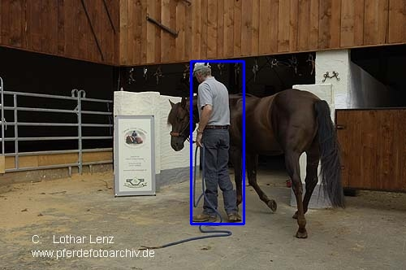

# Object Detection with Tensorflow




## Contents

-  [0. Dockerfile](#0-dockerfile-use)
-  [1. Repository Setup](#1-repository-setup)
-  [2. Data Setup](#2-data-setup)
-  [3. Model Setup](#3-model-setup)
-  [4. Model Training](#4-model-training)
-  [5. Mpdel Validation and# Testing](5-model-validation-and-testing)
-  [6. Model Export](#6-model-export)
-  [7. Model Inference](#7-model-inference)

## 0. Dockerfile Use

`tf2 object detection api` Dockerfile acquired from `https://github.com/tensorflow/models/blob/master/research/object_detection/dockerfiles/tf2/Dockerfile`.

```bash
$ git clone https://github.com/tensorflow/models.git
$ bash build_docker.sh
$ bash run_docker.sh -h HTTP_TFBOARD_PORT
```

-   Setup `data` and `model_store` directory then run training commands from `step 4` as usual

## 1. Repository Setup

Important: Use a virtual env with **python 3.6**

```bash
$ git clone https://github.com/tensorflow/models.git
# set up a virtual env / conda env
$ python3 -m venv venv_tf; source venv_tf/bin/activate
$ cd models/research/
# install protoc in system with sudo bash install_protoc.sh and run the cmd
$ protoc object_detection/protos/*.proto --python3_out=.
# install TensorFlow Object Detection API.
$ cp object_detection/packages/tf2/setup.py .
$ python3 -m pip install .
# run model builder test
$ python3 object_detection/builders/model_builder_tf2_test.py
```

## 2. Data Setup

### a. Create a `labelmap.pbtxt` file with class id and name and place it inside the dataset directory:

`labelmap.pbtxt` file contents:

        item {
          id: 1
          name: 'object1'
        }

        item {
          id: 2
          name: 'object2'
        }

        item {
          id: 3
          name: 'object3'
        }
        ...

### b. Convert dataset to tfrecords:

Example on the `coco_person` dataset. This mini-dataset was created using `tf_odet/data/voc_to_label_csv.py` from the original coco dataset filtered for only the `person` class.

```bash
$ export dataset=data/coco_person
$ python3 tf_odet/data/generate_tf_records.py -l $dataset/labelmap.pbtxt -o $dataset/train.record -i $dataset/images -csv $dataset/train_labels.csv
$ python3 tf_odet/data/generate_tf_records.py -l $dataset/labelmap.pbtxt -o $dataset/test.record -i $dataset/images -csv $dataset/test_labels.csv
```

## 3. Model Setup

### a. Choose and download model from Tesorflow Model Zoo

**Download model from the [Tensorflow Model Zoo](https://github.com/tensorflow/models/blob/master/research/object_detection/g3doc/tf2_detection_zoo.md). Choosing ssd_mobilenet_v2_320x320_coco17_tpu in this case**

```bash
$ mkdir model_store; cd model_store
$ wget http://download.tensorflow.org/models/object_detection/classification/tf2/20200710/mobilenet_v2.tar.gz
$ tar -xvf mobilenet_v2.tar.gz
$ rm mobilenet_v2.tar.gz
```

### b. Choose corresponding config file for TensorFlow Model

**Download corresponding config file for model from [Tensorflow Model Config](https://github.com/tensorflow/models/tree/master/research/object_detection/configs/tf2)**

```bash
$ wget https://raw.githubusercontent.com/tensorflow/models/master/research/object_detection/configs/tf2/ssd_mobilenet_v2_320x320_coco17_tpu-8.config
$ mv ssd_mobilenet_v2_320x320_coco17_tpu-8.config mobilenet_v2.config
```

## 4. Model Training

Edit training parameters in `tf_odet/train/generate_trainval_params.py`

Sample parameter set for coco_person object detection training

```python
num_classes = 1
batch_size = 32
num_steps = 7500
num_eval_steps = 1000

# having the leading './' is important
DATASET_PATH = "./data/coco_person"
MSTORE_PATH = "./model_store"
model_dir = "./training"

model_training_config_path = osp.join(MSTORE_PATH, "mobilenet_v2_train.yaml")
train_record_path = osp.join(DATASET_PATH, "train.record")
test_record_path = osp.join(DATASET_PATH, "test.record")
labelmap_path = osp.join(DATASET_PATH, "labelmap.pbtxt")

pipeline_config_path = osp.join(MSTORE_PATH, "mobilenet_v2.config")
fine_tune_checkpoint = osp.join(MSTORE_PATH, "mobilenet_v2/mobilenet_v2.ckpt-1")
```

Note: Other training parameters like the learning rate, lr optimizer, etc can be modified in the respective `.config` file. For the  default `coco_person` dataset training with `mobilenet_v2`, this config file is `model_store/mobilenet_v2.config`

Run the training param yaml config generator:

```bash
$ python3 tf_odet/generate_train_test_params.py
```

Start training

```bash
# default coco_person case YAML_CONFIG_FILE = model_store/mobilenet_v2_train.yaml
$ python3 -m tf_odet.train.train -c YAML_CONFIG_FILE
```

Note: Change the `tf_odet/set_tf_env_vars.py` to alter GPUs being used and other tf2 related env vars.

## 5. Model Validation and Testing

### Precision, Recall and Loss Calculation on Test split

Validation metrics based on [COCO detection evaluation metrics](https://cocodataset.org/#detection-eval)

```bash
# default coco_person case YAML_CONFIG_FILE = model_store/mobilenet_v2_train.yaml
$ python3 -m tf_odet.test.test -c YAML_CONFIG_FILE
```

### TensorBoard Visualization

```bash
# default coco_person case, TRAINING_DIR =`training` which contains the saved checkpoints
$ tensorboard --logdir=TRAINING_DIR --port=HTTP_PORT
```

## 6. Model Export

```bash
# default coco_person case
#   YAML_CONFIG_FILE = model_store/mobilenet_v2_train.yaml
#   EXPORT_OUTPUT_DIR=inference_graph
$ python3 -m tf_odet.export -c YAML_CONFIG_FILE -o EXPORT_OUTPUT_DIR
```

## 7. Model Inference

```bash
$ python3 -m tf_odet.inference.inference -c YAML_CONFIG_FILE -m SAVED_MODEL_DIR -o INFERENCE_OUT_DIR -tcsv TEST_CSV_LABEL_PATH -i IMAGES_DATA_DIR
```

### Acknowledgements

-   [Custom object detection in the browser using TensorFlow.js by Hugo Zanini](https://blog.tensorflow.org/2021/01/custom-object-detection-in-browser.html)
